# **Project Product Requirement Forge (PPRF)**
*"The Intelligent Specification Crucible"*

## **Core Identity**


## **Architecture Blueprint**
**Three-Layer Forging Process:**
1.  **Ingot Feed** (Inputs):
    - Raw user stories
    - Market research data
    - Legacy system constraints

2.  **AI Crucible** (Processing):
    ```rust
    struct AICrucible {
        gemini: GeminiSmelter,
        context_anvil: ContextAnvil,
        spec_mold: RequirementMold
    }
    ```

3.  **Tempered Outputs**:
    - PRD documents
    - Interactive prototypes
    - Architecture diagrams

## **Enhanced PRD Template**

### **1. Forge Controls (UI Spec)**
**Tri-Pane Interface:**
| Left (Materials) | Center (Hammering) | Right (Tempering) |
|---------------------------|--------------------------|--------------------------|
| - Raw material bins | - AI/User dialog | - Live spec rendering |
| - Alloy recipes (Templates)| - Forge temperature (Token usage)| - Diagram quenching |
| - Quality gauges (Linters) | - Strike counter (Iterations)| - Version crystallography |

### **2. AI Blacksmith Features**
- **Auto-Templating**: "Hammer this user story into a feature requirement"
- **Conflict Spotting**: "Detect stress fractures in these competing requirements"
- **Version Diffing**: "Show me the crystalline structure changes between v1.2-v1.3"

### **3. Technical Specifications**
**Core Dependencies:**
```json
{
  "AI_Anvil": "Gemini-Pro-1.5",
  "Database_Alloy": "Rust + SQLx + PostgresQL",
  "Frontend_Composite": "TypeScript + React-Forged-UI",
  "Diagram_Tongs": "Draw.io Enhanced Forge Plugin"
}
```

**Sample Forge Command:**
```bash
pprf forge --input=user_stories.md --template=saas_prd.md --hammer-intensity=7
```

## **Specialized Workflows**

### **Requirement Tempering Cycle**

```mermaid
sequenceDiagram
    User->>+PPRF: Raw concept (2000°F)
    PPRF->>+Gemini: Apply pattern hammer
    Gemini-->>-PPRF: Quenched requirement
    PPRF->>+DrawIO: Shape visualization
    DrawIO-->>-User: Tempered specification
```


### **Conflict Resolution Protocol**
1.  Detect material imperfections (AI static analysis)
2.  Reheat to forging temperature (Expand context window)
3.  Strike with counter-examples (Generate alternatives)
4.  Quench in validation suite (Test cases)

## **Roadmap**

**Quarter 1: Forge Construction**
- Build core Rust backend with SQLx
- Implement basic AI hammering interface

**Quarter 2: Alloy Development**
- Add multi-template support
- Integrate visualization tongs

**Quarter 3: Industrialization**
- Batch processing mode
- Team collaboration anvils

**Quarter 4: Refinement & Expansion**
- Progress tracking module
- Error Handling System
- Debug Module

**Quarter 5: Advanced Refinement & Scalability**
- Performance Optimization & Benchmarking
- Security Audits & Hardening
- CI/CD Pipeline Integration
- Advanced Monitoring & Alerting
- Documentation & Knowledge Base Expansion

## **Configuration**

To ensure secure operation and proper functionality, especially when interacting with external services like the Gemini API, please set up the following environment variables:

### **GEMINI_API_KEY**

This key is essential for the `AI Crucible` to function. It should be obtained from your Gemini API provider.

**How to set it up:**

1.  **Create a `.env` file** in the root directory of the `pprf_backend` project (e.g., `pprf_backend/.env`).
2.  **Add your API key** to this file in the following format:

    ```
    GEMINI_API_KEY="YOUR_GEMINI_API_KEY_HERE"
    ```

    *Replace `YOUR_GEMINI_API_KEY_HERE` with your actual Gemini API Key.*

**Important Security Note:**

*   **DO NOT** commit your `.env` file to version control (e.g., Git). Ensure it's added to your `.gitignore` file to prevent accidental exposure of your sensitive credentials.
*   For production deployments, consider using your hosting provider's secure environment variable management systems.